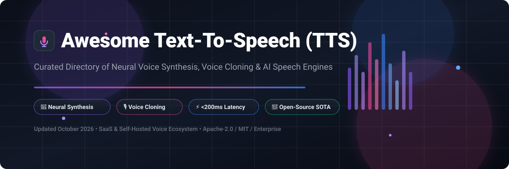

# 🎤 Awesome Text-To-Speech (TTS)

     

> **A comprehensive, SEO-optimized directory of SaaS commercial platforms and open-source GitHub projects for Text-to-Speech (TTS), Neural Voice Synthesis, Voice Cloning, Zero-Shot Speech Generation, and Real-Time Conversational AI.**

---

## 📌 Keywords & Meta
`Text-to-Speech` • `TTS` • `Speech Synthesis` • `Voice Cloning` • `Neural Speech` • `ElevenLabs Alternative` • `Open Source TTS` • `Kokoro-82M` • `GPT-SoVITS` • `ChatTTS` • `Bark` • `Coqui TTS` • `Real-Time Audio API` • `Self-Hosted Voice Models`

---

## 📑 Table of Contents
- [🌐 Market Overview & Sector Analysis](#-market-overview--sector-analysis)
- [🏢 SaaS & Hosted Commercial Platforms](#-saas--hosted-commercial-platforms)
- [⚡ Open-Source GitHub Projects (Sorted by Stars)](#-open-source-github-projects-sorted-by-stars)
- [⚙️ Open-Source Frameworks & Lightweight Libraries](#-open-source-frameworks--lightweight-libraries)
- [🤝 How to Contribute](#-how-to-contribute)
- [⚠️ Disclaimer](#%EF%B8%8F-disclaimer)
- [⭐ Star History](#-star-history)
- [💖 Support & Sponsorship](#-support--sponsorship)

---

## 🌐 Market Overview & Sector Analysis

The global **Text-to-Speech (TTS) and Voice Synthesis market** is estimated at **$4.5 Billion – $5.7 Billion in 2026** and is projected to expand rapidly at a CAGR of **15.2% to 22.4%** through 2035.

**Market Structure & Fragmentation Analysis**: The sector is **moderately fragmented**. Hyperscale cloud providers (**Microsoft Azure, AWS, Google Cloud**) control approximately **31.4% of market share** with enterprise infrastructure SLAs. High-growth AI-native specialists like **ElevenLabs** (valued at $22 Billion) along with domain-focused platforms (Speechify, Murf.ai, Play.ht) capture the remaining **68.6%**, competing heavily on voice fidelity, emotional modulation, sub-200ms streaming latency, zero-shot voice cloning, and ethical watermarking compliance.

---

## 🏢 SaaS & Hosted Commercial Platforms

Below is a detailed comparison of leading cloud-hosted TTS platforms, sorted by **Company Size / Market Capitalization / Valuation (Descending)**.

| 🏢 Platform / Product | 📊 Company Size / Valuation / Revenue | 💰 Starting Paid Price | 🎁 Free Tier Limit / Free Trial | 🌟 Key Strengths & Best For |
| :--- | :--- | :--- | :--- | :--- |
| **[Azure AI Speech](https://azure.microsoft.com/en-us/products/ai-services/ai-speech)** | **$3.1 Trillion** (Microsoft Parent) | **$16.00 / 1M chars** ($0.016/1k chars for Neural TTS) | **500,000 characters/month** free forever (F0 Plan) | **Enterprise standard**: 500+ voices across 140+ languages. Best for Microsoft enterprise integrations. |
| **[Amazon Polly](https://aws.amazon.com/polly/)** | **$2.2 Trillion** (Amazon Parent / $100B+ AWS ARR) | **$4.00 / 1M chars** (Standard) or **$16.00 / 1M chars** (Neural) | **5M Standard & 1M Neural chars/month** free for 1st 12 months | **AWS Native**: 100+ voices, SSML support, lexicons, and speech marks. Best for AWS ecosystem apps. |
| **[Google Cloud TTS](https://cloud.google.com/text-to-speech)** | **$2.1 Trillion** (Alphabet Parent) | **$4.00 / 1M chars** (Standard) or **$16.00 / 1M chars** (Neural2/WaveNet) | **4M Standard & 1M Neural chars/month** free forever | **Google DeepMind Voices**: 380+ voices across 50+ languages. Best for GCP native infrastructure. |
| **[ElevenLabs](https://elevenlabs.io/)** | **$22 Billion** ($500M+ ARR) | **$5.00 / month** (Starter Plan for 30k chars) | **10,000 characters/month** free forever (Non-commercial) | **Market Leader in Quality**: Industry SOTA emotional realism, voice cloning & sub-200ms conversational API. |
| **[Speechify Studio](https://speechify.com/studio/)** | **~$200 Million** (~$50M ARR) | **$29.00 / month** ($289/year annual plan) | **10 minutes of voice generation** free trial | **Audiobook & Studio Leader**: 120+ expressive voices across 20+ languages with detailed emotion control. |
| **[Play.ht](https://play.ht/)** | **~$50 Million** (Podcastle Ecosystem) | **$31.20 / month** ($374.40/year Creator plan) | **12,500 characters** free forever with 1 instant voice clone | **Scalable Content**: 900+ voices across 142 languages, ultra-realistic voice cloning & podcast hosting. |
| **[LOVO AI (Genny)](https://lovo.ai/)** | **~$30 Million** (~$10M ARR) | **$24.00 / month** ($288/year Basic plan) | **14-day free trial** with 20 minutes of voice generation | **Content & Video Editing**: 500+ voices in 100+ languages with integrated video generator. Best for marketing. |
| **[Murf.ai](https://murf.ai/)** | **~$25 Million** (Series A backing) | **$19.00 / user / month** ($228/year Basic plan) | **10 minutes of voice generation** free forever (Single user) | **Studio Voiceovers**: E-learning, presentations, and voice changing. Best for corporate content creators. |
| **[Resemble AI](https://www.resemble.ai/)** | **~$15 Million** (Enterprise Voice AI) | **$0.006 / second** (~$0.36/min Pay-As-You-Go) | **5 minutes of custom voice audio** free trial | **Security & Watermarking**: Real-time voice cloning with built-in deepfake detection and neural watermarks. |
| **[WellSaid Labs](https://wellsaidlabs.com/)** | **~$10 Million** (~$5M ARR) | **$44.00 / month** ($528/year Maker plan) | **7-day free trial** (1 project, 5 audio downloads, 1 voice avatar) | **Enterprise Studio**: Studio-grade artificial voices for high-end corporate training and enterprise learning. |

---

## ⚡ Open-Source GitHub Projects (Sorted by Stars)

Below are top open-source Text-to-Speech models, toolkits, and voice cloning repositories, sorted by **GitHub Star Count (Descending)**.

- **[GPT-SoVITS](https://github.com/RVC-Boss/GPT-SoVITS)**   
  **Powerful Zero-Shot TTS & Voice Cloning** • MIT Licensed  
  Requires as little as **5 seconds of reference audio** for voice cloning. Features zero-shot TTS, cross-lingual voice conversion (English, Japanese, Chinese, Korean, Cantonese), and an intuitive WebUI.

- **[Coqui TTS](https://github.com/coqui-ai/TTS)**  *(Active Fork: [idiap/coqui-ai-TTS](https://github.com/idiap/coqui-ai-TTS))*  
  **The Legendary Open-Source TTS Toolkit** • MPL-2.0 Licensed  
  Comprehensive library implementing SOTA architectures including **XTTS-v2**, VITS, YourTTS, Bark, and Tacotron2. Supports 1,100+ languages with fine-tuning pipelines.

- **[ChatTTS](https://github.com/2noise/ChatTTS)**   
  **Conversational Speech Synthesis Model** • Open-Source  
  Specifically optimized for conversational tasks such as dialogue, podcasts, and agent responses. Native support for interjections like laughter, pauses, and breath control.

- **[Bark](https://github.com/suno-ai/bark)**   
  **Transformer-Based Generative Audio & TTS** • MIT Licensed  
  Developed by Suno. Generates highly expressive speech alongside non-verbal communications (giggles, sighs, weeping), ambient sound effects, and simple background music.

- **[Fish-Speech](https://github.com/fishaudio/fish-speech)**   
  **SOTA Multilingual Dual-AR Foundation Model** • Open-Source  
  Trained on **720,000+ hours** of multilingual speech. Features dual-autoregressive architecture, Firefly-GAN vocoder, **~150ms time-to-first-audio**, and 0.8% WER.

- **[Chatterbox](https://github.com/resemble-ai/chatterbox)**   
  **Permissive Voice Cloning & Paralinguistic TTS** • MIT Licensed  
  Created by Resemble AI. **Chatterbox-Turbo (350M parameters)** offers **sub-200ms latency**, explicit emotion control tags (`[laugh]`, `[cough]`, `[sigh]`), and built-in imperceptible audio watermarking.

- **[CosyVoice2](https://github.com/FunAudioLLM/CosyVoice)**   
  **Alibaba's Multi-Lingual Large Voice Generation Engine** • Apache-2.0 Licensed  
  Supports zero-shot voice cloning, cross-lingual synthesis, instruction-following speech generation, and multi-speaker control.

- **[Dia-1.6B](https://github.com/nari-labs/dia)**   
  **Dialogal & Multi-Speaker Conversational TTS** • Apache-2.0 Licensed  
  Developed by Nari Labs. The first SOTA open-source model designed specifically for **multi-speaker interactive dialogue synthesis** with turn-taking and emotional nuances.

- **[Sherpa-ONNX](https://github.com/k2-fsa/sherpa-onnx)**   
  **Cross-Platform Offline Speech Recognition & TTS** • Apache-2.0 Licensed  
  Ultra-fast ONNX runtime engine supporting offline TTS for 20+ languages across Android, iOS, Raspberry Pi, Windows, Linux, and macOS.

- **[Sesame CSM-1B](https://github.com/SesameAILabs/csm)**   
  **Conversational Speech Model with Long-Horizon Context** • Apache-2.0 Licensed  
  Built for natural human-like pacing, audiobook generation, and seamless dialogue continuity across extended context windows.

- **[PaddleSpeech](https://github.com/PaddlePaddle/PaddleSpeech)**   
  **Baidu's All-in-One Speech Toolkit** • Apache-2.0 Licensed  
  Production-grade framework providing TTS, ASR, translation, and audio classification with pre-trained FastSpeech2 and VITS models.

- **[Piper](https://github.com/rhasspy/piper)**   
  **Fast, Local Neural TTS for Raspberry Pi & Edge** • MIT Licensed  
  Optimized for home automation (Home Assistant) and privacy-first local hardware. Models average ~60MB and run up to **10x faster than real-time on CPU**.

- **[ESPnet](https://github.com/espnet/espnet)**   
  **End-to-End Speech Processing Toolkit** • Apache-2.0 Licensed  
  Research-grade toolkit supporting Kaldi/PyTorch backends for ASR, TTS, speech translation, and neural vocoder experimentations.

- **[Kokoro-82M](https://github.com/hexgrad/kokoro)**   
  **Best Quality-to-Size Ratio Open-Source TTS** • Apache-2.0 Licensed  
  **Only 82 Million parameters**. Ranked **#1 on TTS-Arena** for speed vs. MOS quality ratio. Generates studio audio nearly **100x faster than real-time on GPU**. Supports EN, JP, ZH, KO, FR, DE, IT, PT, ES, HI, RU.

- **[EmotiVoice](https://github.com/netease-youdao/EmotiVoice)**   
  **NetEase Emotional TTS Engine** • Apache-2.0 Licensed  
  Supports multi-voice synthesis with promptable emotional states (happy, angry, sad, fearful, neutral) in English and Chinese.

- **[MeloTTS](https://github.com/myshell-ai/MeloTTS)**   
  **Real-Time CPU Multilingual TTS Engine** • MIT Licensed  
  Developed by MyShell. High-speed inference for English (US, UK, India, Australia), Spanish, French, Chinese, Japanese, and Korean on low-power CPUs.

- **[Zonos](https://github.com/Zyphra/Zonos)**   
  **Expressive Voice & Speech Architecture** • Apache-2.0 Licensed  
  Zyphra's flagship open-source TTS model with expressive control over speech rates, pitch, and voice cloning dynamics.

- **[Orpheus-TTS](https://github.com/canopyai/Orpheus-TTS)**   
  **Llama 3.2 Based Emotional Speech Synthesizer** • Apache-2.0 Licensed  
  Employs SNAC audio tokens for high-fidelity audio synthesis, interpreting natural language emotion tags inside prompts.

- **[Mimic 3](https://github.com/MycroftAI/mimic3)**   
  **Privacy-Friendly Local Neural TTS Engine** • AGPL-3.0 Licensed  
  Built for open-source smart assistants (Mycroft, OVOS). Completely offline operation for embedded single-board computers.

---

## ⚙️ Open-Source Frameworks & Lightweight Libraries

- 🐱 **KittenTTS** — Ultra-lightweight English neural TTS engine running natively on lightweight CPUs.
- 📱 **PocketTTS** — Memory-optimized CPU speech synthesizer for mobile devices (EN, FR, DE, PT, IT, ES).
- 🧬 **MOSS-TTS** — 8 Billion parameter open foundation speech architecture by Fudan University.
- 🗣️ **VoxCPM2** — 30-language tokenized voice generation model with voice cloning.
- 🌐 **OmniVoice** — Local open-source ElevenLabs alternative supporting 646+ regional languages.

---

## 🤝 How to Contribute

Contributions are warmly welcome! Please follow these simple steps:

1. **Fork** this repository to your account.
2. **Create a branch** for your feature or addition (`git checkout -b add-new-tts-engine`).
3. **Edit `README.md`** following our table and star-badge formatting.
4. **Submit a Pull Request** with a concise description of your changes.

---

## ⚠️ Disclaimer

- This is a **community-curated index** provided strictly for informational and educational purposes.
- **Ethical Voice Cloning**: Speech synthesis models can replicate human voices. Always obtain proper authorization and consent before cloning an individual's voice.
- **License Verification**: Licenses vary (Apache-2.0, MIT, MPL-2.0, AGPL-3.0, or custom research licenses). Double-check commercial usability before deploying models to production.

---

## ⭐ Star History

---

## 💖 Support & Sponsorship

Thank you for visiting **Awesome Text-To-Speech (TTS)**! If this repository helped you find the right voice synthesis engine, API, or self-hosted model:

- ⭐ **Star this repository** to help others discover it.
- 🔀 **Fork it** and contribute your favorite TTS tools and projects.
- 📢 **Share it** with your fellow AI developers, audio engineers, and tech communities.

If you would like to support the maintenance of this repository, consider buying me a coffee or becoming a sponsor:

*(See all awesome lists at [Awesome-Awesome-Awesome](https://github.com/ishandutta2007/Awesome-Awesome-Awesome))*

---

  Made with ❤️ by <a href="https://github.com/ishandutta2007">Ishan Dutta</a> and the global open-source AI community.

